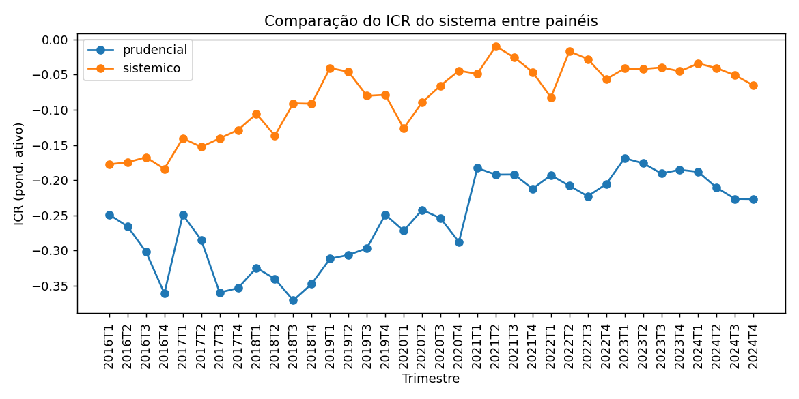
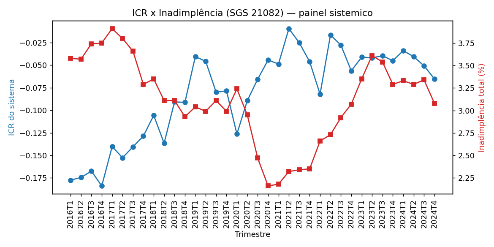
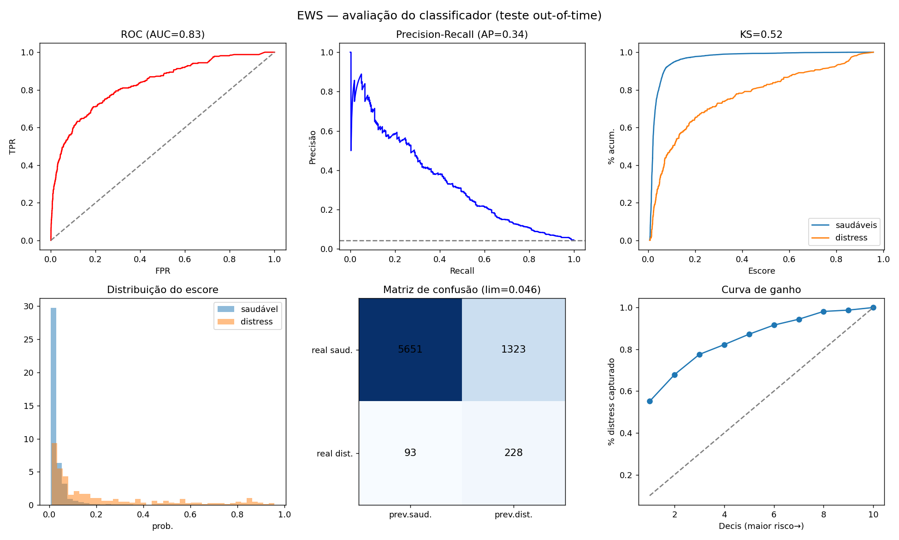
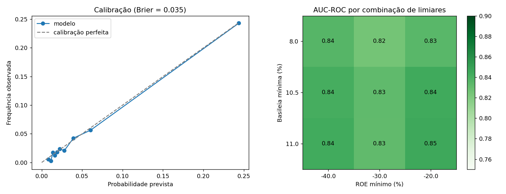

# 4 RESULTADOS E DISCUSSÃO

> **Nota de uso (apagar na versão final):** este capítulo foi redigido para ser
> colado no Word. As tabelas em Markdown são convertidas automaticamente pelo
> Pandoc (`pandoc Resultados_e_Discussao.md -o Resultados.docx`) ou podem ser
> coladas e convertidas pelo próprio Word (Inserir → Tabela → Converter texto em
> tabela). As figuras estão em `figuras/` — cada chamada indica o arquivo a
> inserir. Todos os números provêm da execução real do pipeline (data-base mais
> recente: 4º trimestre de 2024 para a série histórica; 1º trimestre de 2026
> para o recorte com Índice de Basileia dos grandes bancos).

Este capítulo apresenta os resultados da construção e validação do Índice
Composto de Risco (ICR). Adota-se a convenção de que **valores maiores do ICR
indicam maior solidez** (menor risco); a “zona de risco” corresponde ao decil
inferior do índice em cada trimestre.

## 4.1 Base de dados e cobertura

A coleta abrangeu **36 trimestres (1º trimestre de 2016 a 4º trimestre de
2024)** da base IF.Data, complementada por nove séries macroeconômicas do
Sistema Gerenciador de Séries Temporais (SGS) e pelas cotações de cinco bancos
listados na B3. O processo é integralmente reprodutível a partir de APIs
públicas do Banco Central do Brasil.

O recorte encerra-se no 4º trimestre de 2024 por uma razão metodológica: a
partir de 2025 o Banco Central reformou o plano de contas do IF.Data
(Resolução CMN nº 4.966, que introduziu o modelo de perda esperada alinhado ao
IFRS 9), reestruturando os relatórios de Ativo e de Resultado. Essa mudança
quebra a comparabilidade temporal dos indicadores de liquidez e, sobretudo, de
eficiência (Seção 4.10). Optou-se, portanto, por manter toda a série sob um mesmo
padrão contábil.

Um achado metodológico relevante condicionou o desenho do estudo: a API aberta
(Olinda) impõe um *trade-off* entre cobertura e indicador de capital. Conforme a
Tabela 1, o Índice de Basileia só está disponível na visão de Conglomerado
Prudencial (tipo 1), que **não** contém os grandes bancos de varejo; estes
aparecem apenas na visão de Instituição Individual (tipo 3), sem Basileia. Para
não perder nenhuma das duas dimensões, optou-se por construir **dois painéis
complementares**.

**Tabela 1 — Universos de instituições na API IF.Data (Olinda)**

| Painel | Visão (tipo) | Instituições/trim. | Índice de Basileia | Grandes bancos |
|---|---|---:|:---:|:---:|
| Prudencial | Conglomerado Prudencial (1) | ~880 | Sim | Não |
| Sistêmico | Instituição Individual (3) | ~1.470 | Não | Sim |

Fonte: elaboração própria a partir do IF.Data (BCB).

Para superar essa limitação nos trimestres recentes, os índices de capital dos
grandes bancos foram obtidos diretamente dos arquivos do portal IF.Data
(visão prudencial) e reconciliados com os dados individuais por meio de um
*crosswalk* nominal (Seção 4.3.2).

## 4.2 Construção do Índice Composto de Risco

O ICR foi calculado pela soma ponderada dos indicadores padronizados por
trimestre (escore-*z*), com sinal ajustado para a direção de solidez, conforme
a metodologia descrita no Capítulo 1. A Tabela 2 resume os indicadores,
a dimensão CAMELS correspondente, o sinal e o peso prudencial adotado.

**Tabela 2 — Indicadores, dimensões CAMELS, sinais e pesos**

| Indicador | CAMELS | Sinal | Peso | Fonte (relatório IF.Data) |
|---|:---:|:---:|---:|---|
| Índice de Basileia | C (Capital) | + | 0,25 | Resumo |
| Alavancagem (Ativo/PL) | C (Capital) | − | 0,10 | Resumo |
| ROA | E (Rentabilidade) | + | 0,125 | Resumo |
| ROE | E (Rentabilidade) | + | 0,125 | Resumo |
| Índice de Imobilização | M (Gestão) | − | 0,10 | Resumo |
| Liquidez (ativos líquidos/ativo) | L (Liquidez) | + | 0,15 | Ativo |
| Eficiência (custo/receita) | M (Gestão) | − | 0,15 | Dem. de Resultado |

Fonte: elaboração própria. Nota: quando um indicador é indisponível em um
painel, os pesos são renormalizados entre os indicadores remanescentes.

Cabe registrar uma particularidade contábil relevante: no IF.Data, o resultado
(Demonstração de Resultado) é acumulado **por semestre** — reinicia em janeiro e
em julho, conforme o balancete semestral do COSIF. Assim, o ROA e o ROE foram
anualizados pelo fator 12/(mês dentro do semestre), isto é, ×4 no 1º e 3º
trimestres e ×2 no 2º e 4º trimestres, garantindo comparabilidade entre
períodos.

## 4.3 Validação entre instituições

### 4.3.1 Painel sistêmico (grandes bancos)

A Tabela 3 apresenta o ICR dos sete maiores bancos por ativo total no 4º
trimestre de 2024 (painel sistêmico, sem Basileia). O ordenamento é coerente
com a percepção de mercado: BTG Pactual e Itaú Unibanco lideram, enquanto Caixa
e Santander figuram na faixa “Crítico”, penalizados por liquidez e eficiência
mais fracas.

**Tabela 3 — ICR dos maiores bancos por ativo (4º tri. 2024, painel sistêmico)**

| Instituição | ICR | Faixa | ROE (%) | Liquidez (%) | Eficiência (%) |
|---|---:|---|---:|---:|---:|
| Banco do Brasil | −0,02 | Atenção | 19,4 | 40,9 | 60,2 |
| Itaú Unibanco | 0,01 | Adequado | 16,2 | 49,5 | 64,3 |
| Caixa Econômica Federal | −0,21 | Crítico | 14,1 | 26,4 | 59,8 |
| Bradesco | −0,03 | Atenção | 12,7 | 41,6 | 89,3 |
| Santander (Brasil) | −0,14 | Crítico | 15,4 | 35,6 | 125,9 |
| BNDES | 0,06 | Adequado | 16,5 | 23,6 | 7,5 |
| BTG Pactual | 0,14 | Adequado | 21,6 | 58,7 | 66,8 |

Fonte: elaboração própria (IF.Data, visão individual). Nota: ROE anualizado a
partir do resultado semestral acumulado (Seção 4.2).

### 4.3.2 Recorte com CAMELS completo (Índice de Basileia)

Combinando os dados individuais (balanço e resultado) com o Índice de Basileia
da visão prudencial, obteve-se um recorte recente (1º trimestre de 2026,
Tabela 4) que inclui o indicador de capital para os grandes bancos. Como este
período já está sob o novo plano de contas de 2025 (Seção 4.10), o índice é
calculado apenas com os indicadores estáveis (Basileia, Alavancagem, ROA, ROE e
Liquidez), excluindo-se a Eficiência. Nubank lidera (elevada rentabilidade e
capitalização), enquanto Banco do Brasil, Bradesco e Caixa — de menor
rentabilidade e maior alavancagem — situam-se na faixa “Crítico”. Observa-se
que **todos os grandes bancos operam com Basileia entre 14% e 17,5%**, acima do
mínimo regulatório, evidenciando que o risco relativo decorre sobretudo de
rentabilidade e liquidez — e não de insuficiência de capital.

**Tabela 4 — ICR dos grandes bancos com Índice de Basileia (1º tri. 2026,
indicadores estáveis)**

| Instituição | ICR | Faixa | Basileia (%) | ROE (%) | Liquidez (%) |
|---|---:|---|---:|---:|---:|
| Nubank (Nu Pagamentos) | −0,04 | Adequado | 15,1 | 26,9 | 1,2 |
| BTG Pactual | −0,19 | Atenção | 15,9 | 24,5 | 64,0 |
| Banco Votorantim (BV) | −0,19 | Atenção | 15,0 | 15,0 | 35,4 |
| Banco Safra | −0,20 | Atenção | 17,3 | 22,6 | 46,6 |
| Santander (Brasil) | −0,29 | Atenção | 15,2 | 15,8 | 44,3 |
| Itaú Unibanco | −0,29 | Atenção | 14,8 | 24,5 | 46,9 |
| Banrisul | −0,37 | Atenção | 17,5 | 7,8 | 45,8 |
| Bradesco | −0,53 | Crítico | 14,9 | 11,6 | 39,5 |
| Banco do Brasil | −0,56 | Crítico | 14,2 | 6,5 | 40,5 |
| Caixa Econômica Federal | −0,62 | Crítico | 15,1 | 10,8 | 30,8 |

Fonte: elaboração própria (IF.Data individual + portal IF.Data, visão prudencial).

## 4.4 Validação temporal

A Figura 1 apresenta a evolução do ICR médio do sistema (ponderado por ativo)
nos dois painéis. No painel sistêmico, o índice eleva-se de **−0,177 (1º tri.
2016)**, no auge da recessão, para **−0,065 (4º tri. 2024)**, com mínimo em
2016T4 e recuperação consistente ao longo da série; o efeito da pandemia
(2020T1) é visível como uma inflexão temporária. O painel prudencial segue
trajetória semelhante, em patamar inferior. A coerência da série com o ciclo
econômico observado corrobora a validade temporal do índice (KAMINSKY;
REINHART, 1999).

**Figura 1 — Evolução do ICR médio do sistema por painel (2016–2024)**
*(inserir: `figuras/comparacao_paineis.png`)*

Fonte: elaboração própria.

## 4.5 Validação macroeconômica

Correlacionou-se o ICR médio do sistema com as séries agregadas do SGS. A
Tabela 5 mostra correlação **negativa e forte** no painel sistêmico: sistemas
mais sólidos (ICR maior) convivem com menor inadimplência e menor *spread* — o
sinal teoricamente esperado. O painel prudencial apresenta correlações na mesma
direção, porém de menor magnitude, indicando que cooperativas e bancos médios
são menos sensíveis à dinâmica macroeconômica sistêmica do que os grandes
bancos — um resultado de interesse para a discussão.

**Tabela 5 — Correlação entre o ICR do sistema e séries do SGS (n = 36)**

| Série (SGS) | Pearson (sistêmico) | Pearson (prudencial) |
|---|---:|---:|
| *Spread* — pessoa física | −0,82 | −0,48 |
| *Spread* — pessoa jurídica | −0,71 | −0,36 |
| Inadimplência — pessoa jurídica | −0,70 | −0,49 |
| Inadimplência — total | −0,62 | −0,27 |
| *Spread* — total | −0,56 | −0,17 |
| Inadimplência — pessoa física | −0,51 | −0,02 |

Fonte: elaboração própria (SGS/BCB). Nota: correlação de Pearson. A inadimplência
de pessoa física no painel prudencial é a única série com correlação praticamente
nula (−0,02; n=36), coerente com a menor exposição das cooperativas a esse
segmento.

A Figura 2 ilustra graficamente a relação inversa entre o ICR sistêmico e a
inadimplência total.

**Figura 2 — ICR do sistema versus inadimplência total (painel sistêmico)**
*(inserir: `figuras/sistemico/icr_vs_inadimplencia.png`)*

Fonte: elaboração própria (IF.Data e SGS/BCB).

## 4.6 Validação com o mercado de capitais (B3)

Como camada adicional de validação prevista na metodologia, cruzou-se o ICR dos
bancos de capital aberto com o preço de suas ações (cotações trimestrais). A
Tabela 6 mostra **correlação positiva entre o ICR e o preço da ação em todos os
cinco bancos** analisados — instituições com índice mais sólido tendem a
apresentar maior valorização —, com destaque para Santander (0,52) e Banco do
Brasil (0,46). A correlação entre variações do ICR e retornos trimestrais é
fraca, o que é esperado dada a natureza antecipatória dos preços e o ruído de
curto prazo.

**Tabela 6 — Correlação entre ICR e ações (B3)**

| Ação | Banco | Corr. ICR × preço | n |
|---|---|---:|---:|
| SANB11 | Santander | 0,52 | 34 |
| BBAS3 | Banco do Brasil | 0,46 | 34 |
| BPAC11 | BTG Pactual | 0,38 | 32 |
| BBDC4 | Bradesco | 0,33 | 34 |
| ITUB4 | Itaú Unibanco | 0,23 | 34 |

Fonte: elaboração própria (IF.Data e Yahoo Finance).

## 4.7 Explicabilidade

Por se tratar de índice linear, a contribuição de cada indicador para o ICR é
exata (peso × escore-*z*). A Tabela 7 apresenta a importância média (|contribuição|)
no painel sistêmico, em que a liquidez responde por cerca de um terço da
dispersão do índice, seguida por ROE, alavancagem e ROA — praticamente empatados
em torno de 17% (Tabela 7).

**Tabela 7 — Importância dos indicadores no ICR (painel sistêmico)**

| Indicador | Importância (%) |
|---|---:|
| Liquidez | 33,3 |
| ROE | 17,4 |
| Alavancagem | 17,2 |
| ROA | 16,9 |
| Eficiência | 15,2 |

Fonte: elaboração própria. Nota: Basileia e Imobilização não compõem este
painel (ver Seção 4.1).

## 4.8 Modelo de Alerta Precoce (EWS)

Para além da descrição do risco, treinou-se um modelo de alerta precoce com
alvo **externo e prospectivo**, evitando a circularidade de prever o próprio
índice. Define-se evento de *distress* na instituição *i* no trimestre *t* como
**Índice de Basileia inferior a 10,5%** (quebra do requerimento mais o colchão
de conservação) **ou ROE inferior a −30%** (prejuízo severo). O alvo é a
ocorrência de *distress* em **algum dos quatro trimestres seguintes** (*t*+1 a
*t*+4), e as variáveis explicativas são os indicadores correntes. Utilizou-se o
painel prudencial (que dispõe de Basileia) e validação **fora do tempo** (o
modelo é treinado nos trimestres mais antigos e testado nos mais recentes da
janela observável), com um **embargo de 4 trimestres** no limiar do split — os
trimestres imediatamente anteriores ao corte são removidos do treino, pois seus
rótulos olhariam para o período de teste —, eliminando qualquer *look-ahead*.
Utiliza-se um classificador de *gradient boosting*.

O modelo alcançou **AUC-ROC de 0,83** no conjunto de teste, com taxa-base de
*distress* de apenas 4,4% (Tabela 8) — desempenho compatível com a literatura
internacional de alerta precoce (BETZ et al., 2014; LANG; PELTONEN; SARLIN,
2018). A curva ROC é apresentada na Figura 3.

**Tabela 8 — Desempenho do modelo de alerta precoce (teste fora do tempo)**

| Métrica | Valor |
|---|---:|
| Observações de treino | 17.772 |
| Observações de teste | 7.295 |
| Taxa-base de *distress* (teste) | 4,4% |
| AUC-ROC | 0,83 |
| AUC-PR (precisão média) | 0,34 |
| **KS** (Kolmogorov-Smirnov) | **0,52** |

Fonte: elaboração própria. Nota: como o evento é raro (~5%), a acurácia é
inadequada (prever "nenhum distress" acertaria 95% e não capturaria nenhum
caso). Empregam-se, portanto, métricas próprias para classes desbalanceadas —
AUC-ROC, AUC-PR e, sobretudo, o **KS**, padrão em *credit scoring* (valores
acima de 0,3 são considerados bons; obteve-se **0,52**).

O painel completo de avaliação (Figura 3) reúne as curvas ROC e Precisão-Recall,
a estatística KS, a distribuição do escore por classe, a matriz de confusão e a
curva de ganho. Esta última tem valor operacional direto: **inspecionar apenas o
decil de maior risco (10% das instituições) captura 55% de todos os casos de
distress** — um *lift* de 5,5 vezes sobre a triagem aleatória, o que sustenta o
uso do **escore do modelo de alerta precoce (não do ICR em si)** como instrumento
de priorização de supervisão.

**Figura 3 — Painel de avaliação do modelo de alerta precoce (teste out-of-time)**
*(inserir: `figuras/distress_avaliacao.png`)*

Fonte: elaboração própria.

As variáveis mais preditivas do *distress* futuro (Tabela 9) são a
**rentabilidade** (ROE, com importância de 0,55, seguido de ROA) e a
**eficiência**, confirmando que a deterioração dos resultados antecede a quebra
de capital — em linha direta com Rosa e Gartner (2018), que identificaram
rentabilidade e eficiência como as variáveis mais sensíveis em bancos nacionais.

**Tabela 9 — Importância das variáveis no modelo de alerta precoce**

| Variável | Importância |
|---|---:|
| ROE | 0,55 |
| ROA | 0,12 |
| Eficiência | 0,09 |
| Índice de Basileia | 0,08 |
| Imobilização | 0,07 |
| Liquidez | 0,06 |
| Alavancagem | 0,04 |

Fonte: elaboração própria.

Aplicando-se o modelo ao trimestre mais recente, obtém-se uma lista de
vigilância (*watchlist*) das instituições com maior probabilidade estimada de
*distress* — todas cooperativas de crédito de menor porte com ROE fortemente
negativo e capitalização próxima do mínimo regulatório —, demonstrando a
aplicabilidade prática do modelo como instrumento de monitoramento.

Duas verificações adicionais reforçam a robustez do modelo (Figura 4). Primeiro,
a **calibração**: as probabilidades previstas acompanham de perto a frequência
real de distress observada, com **Brier score de 0,035** (inferior à taxa-base),
o que indica que os valores podem ser interpretados como probabilidades, e não
apenas como ordenação. Segundo, a **sensibilidade aos limiares** (Tabela 10):
reestimando o modelo para nove combinações de cortes de Basileia (8%, 10,5%,
11%) e de ROE (−20%, −30%, −40%), o desempenho permanece estável — **AUC-ROC
entre 0,82 e 0,85 e KS entre 0,51 e 0,55** —, evidenciando que o resultado não
é artefato da definição adotada.

**Tabela 10 — Sensibilidade do EWS aos limiares de distress**

| Basileia mín. | ROE mín. | Taxa-base | AUC-ROC | KS |
|---:|---:|---:|---:|---:|
| 10,5% | −20% | 7,1% | 0,84 | 0,54 |
| 10,5% | −30% | 5,0% | 0,83 | 0,52 |
| 10,5% | −40% | 4,1% | 0,84 | 0,55 |
| 8,0% | −30% | 4,9% | 0,82 | 0,51 |
| 11,0% | −30% | 5,2% | 0,83 | 0,52 |

Fonte: elaboração própria. Nota: grade completa (9 combinações) em
`distress_sensibilidade.csv`.

**Figura 4 — Calibração e robustez do EWS aos limiares**
*(inserir: `figuras/distress_robustez.png`)*

Fonte: elaboração própria.

## 4.9 Síntese dos resultados

As quatro validações abaixo confirmam, de forma convergente, a **consistência
contemporânea** do ICR proposto — isto é, que o índice é um retrato fiel da solidez
no mesmo período, e não que ele preveja o futuro:

a) **Entre instituições**, o ordenamento é coerente com o porte, a rentabilidade
   e a percepção de mercado (Tabelas 3 e 4);

b) **Temporalmente**, o índice acompanha o ciclo econômico, recuperando-se após
   a recessão de 2015–2016 e refletindo o choque de 2020 (Figura 1);

c) **Macroeconomicamente**, correlaciona-se negativamente com inadimplência e
   *spread*, com maior intensidade no segmento sistêmico (Tabela 5);

d) **No mercado de capitais**, associa-se positivamente ao preço das ações dos
   bancos listados (Tabela 6).

Adicionalmente — e como artefato **distinto** do índice, não como uma quinta
validação de consistência —, os mesmos indicadores CAMELS *correntes* sustentam um
**modelo de alerta precoce** com AUC de 0,83, demonstrando que dados públicos
antecipam *distress* com até um ano de antecedência (Tabelas 8 e 9). A antecipação,
portanto, é atributo do modelo preditivo (e da validação prospectiva da reforma de
2025), e não do ICR descritivo em si.

## 4.10 Limitações

a) **Reforma contábil de 2025 (Resolução CMN nº 4.966).** A adoção do modelo de
   perda esperada (IFRS 9) reestruturou os relatórios de Ativo e de Resultado do
   IF.Data a partir de 2025, quebrando a comparabilidade temporal da liquidez e,
   principalmente, da eficiência. Por isso a série principal encerra-se em 2024T4
   (Seção 4.1) e o recorte recente (Tabela 4) emprega apenas indicadores
   estáveis. A reconciliação entre os planos de contas antigo e novo fica como
   trabalho futuro.

b) **Trade-off na API aberta.** O Índice de Basileia dos grandes bancos não é
   exposto pela API Olinda (apenas na visão prudencial do portal, disponível de
   2025 em diante). O CAMELS completo dos grandes bancos, portanto, só é
   observável no recorte recente.

c) **Rótulo de distress por limiar.** O evento de *distress* baseia-se em
   limiares prudenciais futuros (Basileia < 10,5% ou ROE < −30%). Um EWS pleno
   ganharia robustez usando eventos reais de regime especial/liquidação como
   alvo.

d) **Instituições de porte reduzido.** A eficiência (custo/receita) é instável
   quando a receita operacional se aproxima de zero (fintechs incipientes); a
   winsorização mitiga o efeito no escore-*z*, mas recomenda-se elevar o corte de
   porte em análises focadas em bancos.

Em conjunto, esses achados respondem afirmativamente à pergunta central do
trabalho: **é possível construir um indicador confiável de risco bancário
apenas com dados públicos do Banco Central**.
